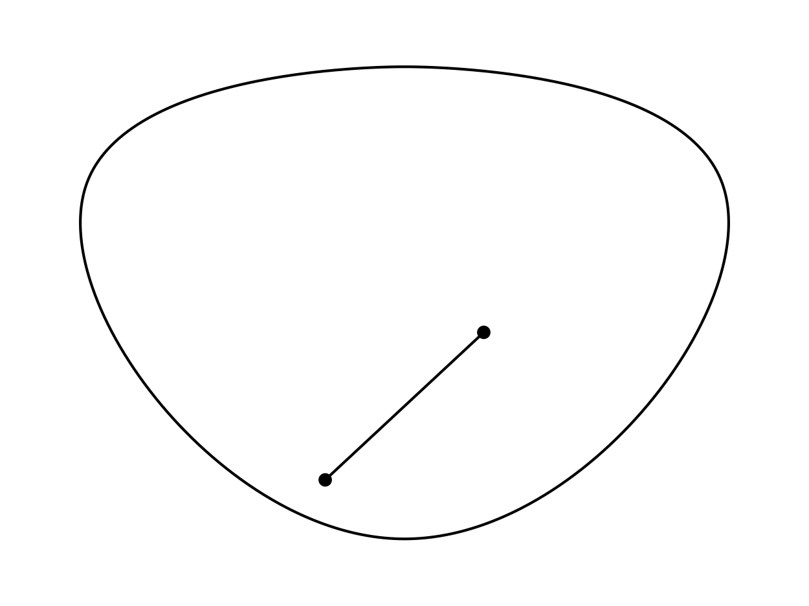
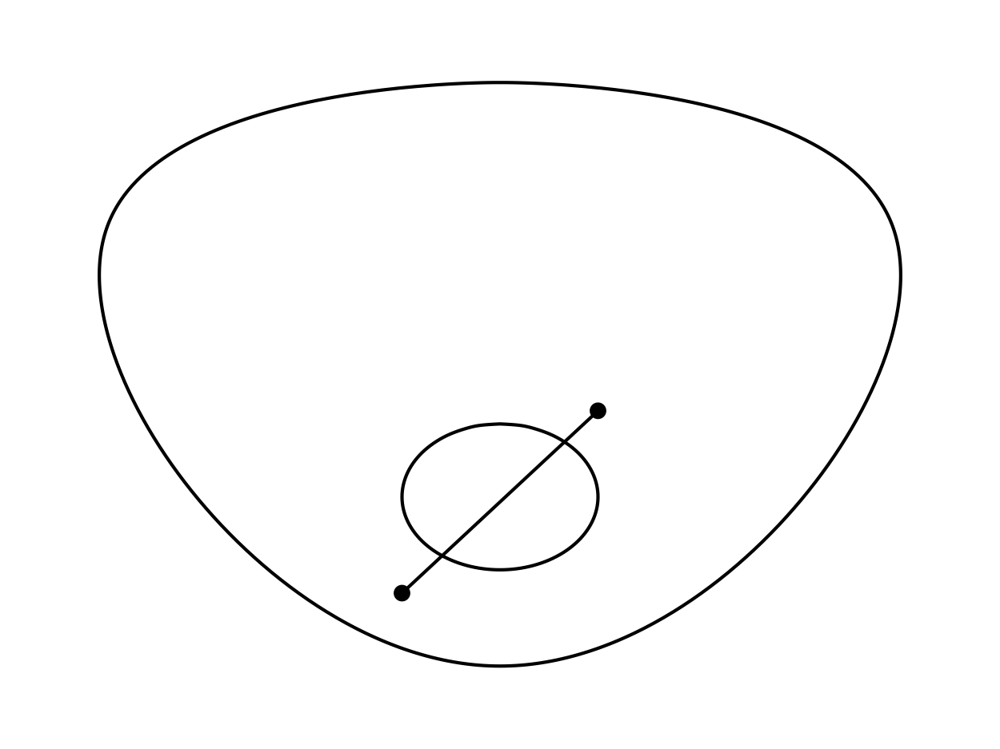
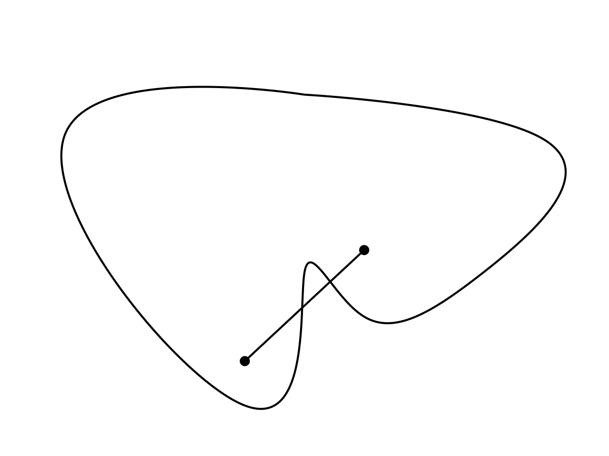

A function $f(x)$ is convex if:

\[
f(\alpha x + (1 - \alpha) x) = f(\alpha x) + f((1- \alpha) x)
\]

A shape is convex if any two points inside the shape are connected by a line that never passes outside of the shape.

Disc goes here.

Disc with hole goes here.

Irregular shape goes here.

A function's convexity can be defined in terms of the shape of the epigraph of the function, which consists of all points in the domain that lie above the function.

Convexity is central in the theory of optimization because strictly convex functions have a unique global minimum. Vice versa, concave functions have a unique global maximum. This means that even stupid methods like gradient descent have a good chance of eventually getting to the optimal solution. If tuned properly, they can even be guaranteed to get there.

In statistics and ML, we typically care whether the likelihood function is log-concave, since we will work with the log likelihood function and want it to be concave for maximization.

When functions are not convex or concave, we can try to use sub-gradients.
